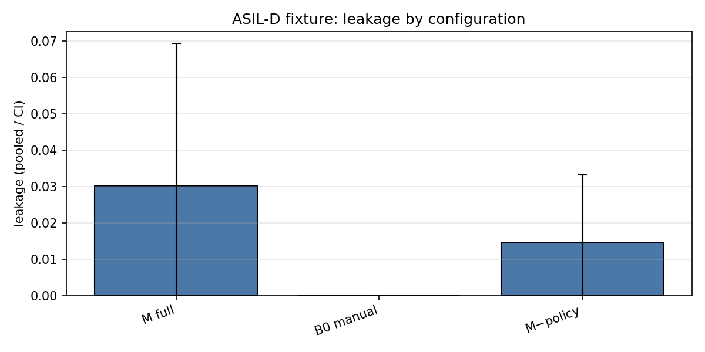

# ASIL-D worked example: steering-torque arbitration

***Synthetic / illustrative*** fixture (see `ASSUMPTIONS.md`). Stricter policy than the AEB fixture: mandatory independent human review at every gate, branch/MC-DC coverage targets of 100%, retry budget k=5.

## Per-configuration results (mean [95% CI] over 12 seeds)

| Config | Final TC | Leakage (pooled) | Struct esc | Sem esc | Total min | Retries | Budget exhaust |
|--------|----------|------------------|------------|---------|-----------|---------|---------------|
| `M` | 1.000 [1.000, 1.000] | 0.0301 | 0 | 4 | 4296.8 [4147.7, 4456.8] | 8.2 | 0.00 |
| `B0` | 1.000 [1.000, 1.000] | 0.0000 | 0 | 0 | 14704.4 [14297.8, 15105.5] | 5.0 | 0.00 |
| `M-nopolicy` | 1.000 [1.000, 1.000] | 0.0144 | 0 | 2 | 4088.5 [3976.4, 4190.1] | 8.4 | 0.00 |

## Is the ASIL policy contribution visible?

M-full pooled leakage: 0.0301; M-nopolicy pooled leakage: 0.0144. 
No visible policy contribution on this fixture at these seeds: the ledger invariant checks already cover the policy subset (S2/M4), so the policy layer is redundant when the ledger protocol is active (negative control, as on the AEB fixture).

