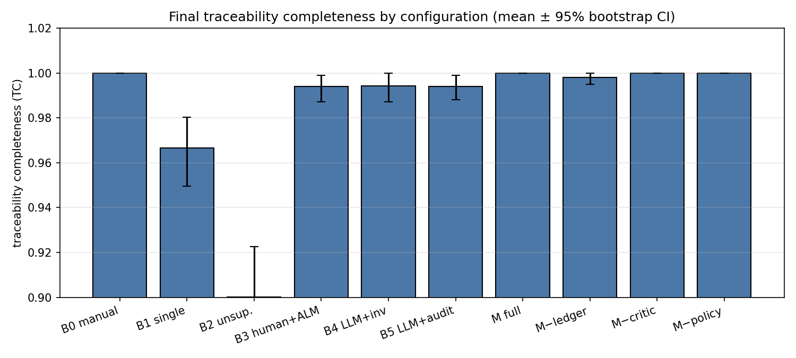
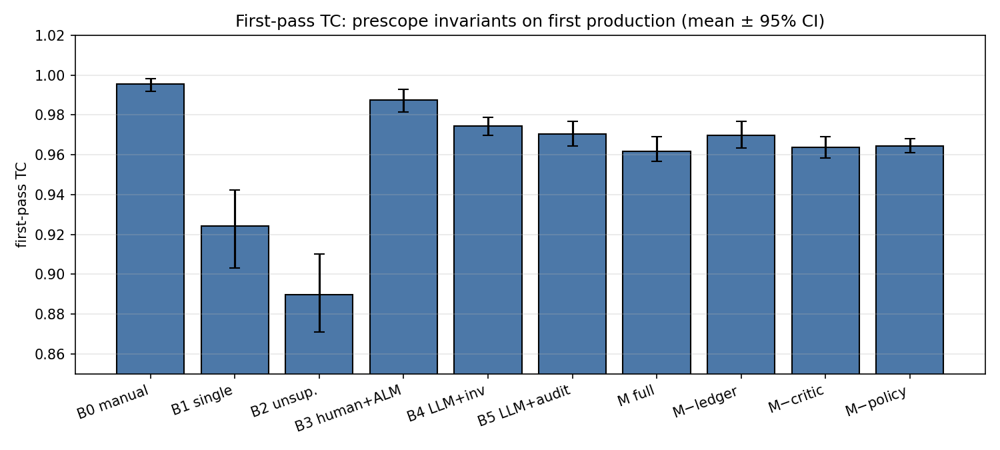
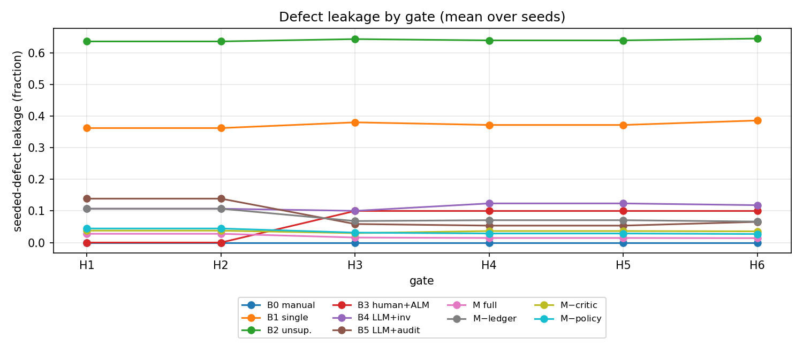
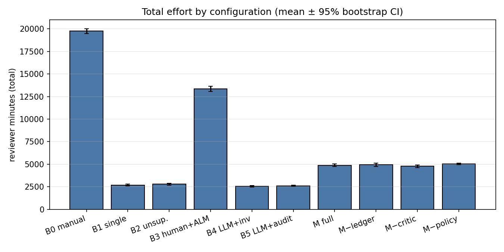
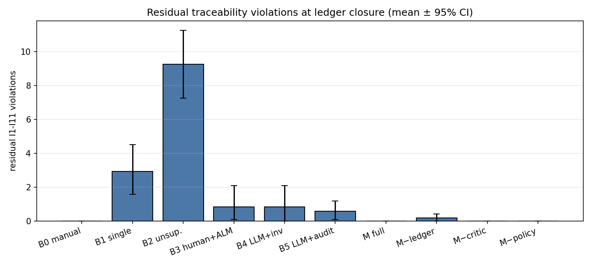
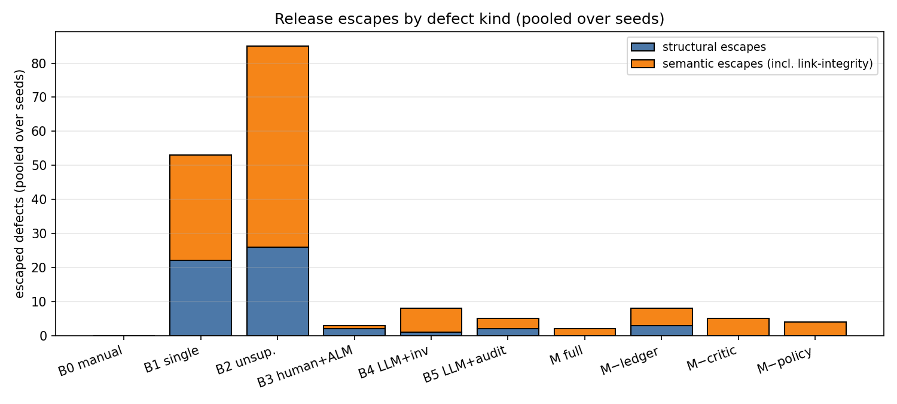

# MAVERICK Evaluation Harness v3 -- Results

Simulated evaluation of the MAVERICK multi-agent orchestration pipeline (ASPICE SWE.1-SWE.6, safety-supervised) against baselines and ablations, on the AEB (ASIL-B/QM) worked-example fixture.

> **Simulation, not measurement.** All numbers below are outputs of a seeded behavioral simulation (``SimulatedLLM`` defect injection + calibrated reviewer/critic models). No real LLM was called. Every number comes from the actual run; assumptions are documented in ``ASSUMPTIONS.md``.

## Configurations

| ID | Description |
|----|-------------|
| `B0` | Manual baseline: Humans author and review every artifact (no LLM). |
| `B1` | Single LLM agent: One LLM agent performs all V-model steps; cursory review. |
| `B2` | Unsupervised multi-agent (shared pool): Role agents share one message pool; no ledger, no supervisor. |
| `B3` | Human + ALM link checks: Humans author; automated ALM-style link-existence checks. |
| `B4` | LLM + advisory invariant checks: LLM pipeline; invariant checks run as non-blocking post-checks. |
| `B5` | LLM + post-hoc audit: LLM pipeline plus a Sameh & Elbanna-style post-hoc audit. |
| `M` | Full MAVERICK: Ledger + supervisor policy + critic + enforced human gates. |
| `M-noledger` | MAVERICK without ledger protocol: M minus invariant checks, suspect propagation, lifecycle enforcement. |
| `M-nocritic` | MAVERICK without LLM critic: M minus the critic; policy + human review remain. |
| `M-nopolicy` | MAVERICK without supervisor policy: M minus deterministic policy checks; ledger + critic remain. |

## Per-configuration results (mean [95% bootstrap CI] over 12 seeds)

Leakage = seeded defects escaping the gate pipeline (pooled value in the `leakage_pooled` column of `summary.csv`). Structural/semantic escape columns are pooled defect counts. Retries = Phase-A rework loops; budget exhaustions = escalations after k retries.

| Config | Final TC | First-pass TC | Leakage | Struct esc | Sem esc | Residual viol | Total min | Authoring min | Review min | Retries | Budget exhaust |
|--------|----------|---------------|---------|----------|---------|-------------|-----------|---------------|------------|---------|--------------|
| `B0` | 1.000 [1.000, 1.000] | 0.996 [0.992, 0.998] | 0.000 [0.000, 0.000] | 0 | 0 | 0.00 | 19763.3 [19485.3, 20014.1] | 9015.5 [8730.6, 9317.6] | 10535.4 [10106.3, 10931.8] | 1.7 | 0.00 |
| `B1` | 0.967 [0.950, 0.980] | 0.924 [0.903, 0.942] | 0.386 [0.304, 0.477] | 22 | 31 | 2.92 | 2688.1 [2570.7, 2787.1] | 436.0 [423.8, 449.4] | 1997.1 [1912.0, 2084.6] | 0.0 | 4.17 |
| `B2` | 0.900 [0.879, 0.923] | 0.890 [0.871, 0.910] | 0.645 [0.577, 0.719] | 26 | 59 | 9.25 | 2792.8 [2683.5, 2897.8] | 426.9 [412.4, 441.8] | 2353.4 [2258.5, 2445.2] | 0.0 | 0.00 |
| `B3` | 0.994 [0.987, 0.999] | 0.988 [0.981, 0.993] | 0.120 [0.000, 0.250] | 2 | 1 | 0.83 | 13367.7 [13029.8, 13641.8] | 9268.6 [8972.7, 9507.4] | 4094.1 [3969.9, 4237.4] | 0.7 | 0.00 |
| `B4` | 0.994 [0.987, 1.000] | 0.974 [0.970, 0.979] | 0.118 [0.040, 0.214] | 1 | 7 | 0.83 | 2546.8 [2477.6, 2617.1] | 454.4 [445.1, 463.8] | 2055.8 [1979.9, 2134.0] | 0.7 | 0.00 |
| `B5` | 0.994 [0.988, 0.999] | 0.971 [0.964, 0.977] | 0.065 [0.024, 0.115] | 2 | 3 | 0.58 | 2611.0 [2557.9, 2663.4] | 446.7 [435.7, 457.6] | 1243.4 [1199.4, 1286.0] | 0.0 | 0.00 |
| `M` | 1.000 [1.000, 1.000] | 0.962 [0.957, 0.969] | 0.014 [0.000, 0.034] | 0 | 2 | 0.00 | 4875.1 [4730.9, 5031.9] | 459.0 [446.5, 471.6] | 4145.3 [4007.1, 4295.0] | 4.5 | 0.00 |
| `M-noledger` | 0.998 [0.995, 1.000] | 0.970 [0.963, 0.977] | 0.066 [0.021, 0.117] | 3 | 5 | 0.17 | 4946.9 [4745.7, 5123.1] | 463.4 [448.7, 478.9] | 4292.6 [4105.7, 4456.5] | 1.8 | 0.00 |
| `M-nocritic` | 1.000 [1.000, 1.000] | 0.964 [0.958, 0.969] | 0.036 [0.012, 0.060] | 0 | 5 | 0.00 | 4763.9 [4623.9, 4914.0] | 465.7 [450.9, 480.6] | 4160.1 [4020.3, 4309.7] | 4.3 | 0.00 |
| `M-nopolicy` | 1.000 [1.000, 1.000] | 0.965 [0.961, 0.968] | 0.027 [0.000, 0.058] | 0 | 4 | 0.00 | 5031.6 [4927.1, 5132.9] | 443.9 [436.6, 450.5] | 4314.6 [4203.5, 4424.3] | 4.5 | 0.00 |

Pooled leakage (total escaped / total injected):

- `B0`: 0.0000
- `B1`: 0.3732
- `B2`: 0.6489
- `B3`: 0.1154
- `B4`: 0.1067
- `B5`: 0.0625
- `M`: 0.0138
- `M-noledger`: 0.0645
- `M-nocritic`: 0.0385
- `M-nopolicy`: 0.0284

## Effect sizes: M-full vs each comparator (paired by seed, n=12)

Cliff's delta (matched-pairs rank-biserial) is the primary effect size -- better behaved than p at n=12. Positive delta: M-full has the *higher* value (good for TC, bad for leakage/minutes). Wilcoxon signed-rank p-values are Holm-adjusted across the family; `p_adj < 0.05` marked (*). Magnitude: negligible <0.147 < small <0.33 < medium <0.474 < large. `n` = paired seeds (seeds where either side injected zero defects are excluded as NaN).

| Comparison | Metric | M mean | Comparator mean | Cliff's delta | Magnitude | p (Holm-adj) | n |
|------------|--------|--------|-----------------|---------------|-----------|--------------|---|
| M vs `B0` | leakage | 0.021 | 0.000 | 0.250 | small | 1.0000 | 8 |
| M vs `B0` | reviewer minutes | 4875.087 | 19763.272 | -1.000 | large | 0.0449 (*) | 12 |
| M vs `B1` | leakage | 0.014 | 0.386 | -1.000 | large | 0.0449 (*) | 12 |
| M vs `B1` | reviewer minutes | 4875.087 | 2688.099 | 1.000 | large | 0.0449 (*) | 12 |
| M vs `B2` | leakage | 0.014 | 0.645 | -1.000 | large | 0.0449 (*) | 12 |
| M vs `B2` | reviewer minutes | 4875.087 | 2792.822 | 1.000 | large | 0.0449 (*) | 12 |
| M vs `B3` | leakage | 0.017 | 0.120 | -0.200 | small | 1.0000 | 10 |
| M vs `B3` | reviewer minutes | 4875.087 | 13367.727 | -1.000 | large | 0.0449 (*) | 12 |
| M vs `B4` | leakage | 0.014 | 0.118 | -0.500 | large | 0.3603 | 12 |
| M vs `B4` | reviewer minutes | 4875.087 | 2546.829 | 1.000 | large | 0.0449 (*) | 12 |
| M vs `B5` | leakage | 0.014 | 0.065 | -0.250 | small | 0.6739 | 12 |
| M vs `B5` | reviewer minutes | 4875.087 | 2610.967 | 1.000 | large | 0.0449 (*) | 12 |
| M vs `M-noledger` | leakage | 0.014 | 0.066 | -0.250 | small | 0.8624 | 12 |
| M vs `M-noledger` | reviewer minutes | 4875.087 | 4946.915 | -0.167 | small | 1.0000 | 12 |
| M vs `M-nocritic` | leakage | 0.014 | 0.036 | -0.250 | small | 1.0000 | 12 |
| M vs `M-nocritic` | reviewer minutes | 4875.087 | 4763.886 | 0.167 | small | 1.0000 | 12 |
| M vs `M-nopolicy` | leakage | 0.014 | 0.027 | -0.083 | negligible | 1.0000 | 12 |
| M vs `M-nopolicy` | reviewer minutes | 4875.087 | 5031.573 | -0.500 | large | 0.8624 | 12 |

## RQ3: structural coverage (achieved vs ASIL-indexed target)

The coverage stub models *achieved* coverage as a function of the configuration's verification rigor (documented assumption in `metrics.py`): a pipeline that skips verification measures lower coverage. The table reports the minimum branch coverage achieved across units vs the ASIL-B working target of 80% (H4; documented assumption, not an ISO-prescribed percentage).

| Config | Min branch achieved | ASIL-B target | Shortfall |
|--------|---------------------|---------------|-----------|
| `B0` | 93.9% | 80% | -13.9% |
| `B1` | 75.8% | 80% | 4.2% |
| `B2` | 72.0% | 80% | 8.0% |
| `B3` | 86.4% | 80% | -6.4% |
| `B4` | 76.1% | 80% | 3.9% |
| `B5` | 85.5% | 80% | -5.5% |
| `M` | 94.5% | 80% | -14.5% |
| `M-noledger` | 94.1% | 80% | -14.1% |
| `M-nocritic` | 95.9% | 80% | -15.9% |
| `M-nopolicy` | 96.4% | 80% | -16.4% |

## Critic operating characteristics (seeded ground truth)

| Config | Precision (mean) | Recall (mean) |
|--------|------------------|---------------|
| `B0` | n/a (critic disabled) | n/a (critic disabled) |
| `B1` | n/a (critic disabled) | n/a (critic disabled) |
| `B2` | n/a (critic disabled) | n/a (critic disabled) |
| `B3` | n/a (critic disabled) | n/a (critic disabled) |
| `B4` | n/a (critic disabled) | n/a (critic disabled) |
| `B5` | n/a (critic disabled) | n/a (critic disabled) |
| `M` | 0.333 | 0.748 |
| `M-noledger` | 0.315 | 0.757 |
| `M-nocritic` | n/a (critic disabled) | n/a (critic disabled) |
| `M-nopolicy` | 0.257 | 0.587 |

## Detection mechanism breakdown (pooled over seeds)

| Config | ledger | alm | policy | critic | human-review | human-escalation | coverage | test | audit |
|--------|--------|-----|--------|--------|----------------|------------------|----------|------|-------|
| `B0` | 8 | 0 | 0 | 0 | 3 | 0 | 0 | 0 | 0 |
| `B1` | 0 | 0 | 0 | 0 | 57 | 50 | 0 | 15 | 0 |
| `B2` | 0 | 0 | 0 | 0 | 68 | 0 | 0 | 0 | 0 |
| `B3` | 0 | 8 | 0 | 0 | 15 | 0 | 0 | 0 | 0 |
| `B4` | 0 | 0 | 8 | 0 | 62 | 0 | 0 | 0 | 0 |
| `B5` | 0 | 0 | 0 | 0 | 76 | 0 | 0 | 0 | 4 |
| `M` | 72 | 0 | 0 | 55 | 18 | 0 | 0 | 0 | 0 |
| `M-noledger` | 0 | 0 | 16 | 49 | 55 | 0 | 1 | 0 | 0 |
| `M-nocritic` | 71 | 0 | 0 | 0 | 56 | 0 | 1 | 1 | 0 |
| `M-nopolicy` | 72 | 0 | 0 | 42 | 26 | 0 | 1 | 0 | 0 |

## Figures

## Further analyses

- `sweep.md`: one-way sensitivity sweeps + break-even analysis (run with `python run.py --sweep`).
- `asild.md`: ASIL-D steering-torque arbitration fixture (run with `python run.py --asild`).

## Artifacts

- `summary.csv`: per-configuration aggregates.
- `per_seed.csv`: one row per (config, seed).
- `leakage_by_gate.csv`: seeded-defect leakage per gate.
- `violations_by_gate.csv`: residual I1-I11 violations per gate.
- `defects.csv`: every injected defect with detection outcome.
- `ASSUMPTIONS.md`: documented assumption register.
- `figures/`: PNG figures.
