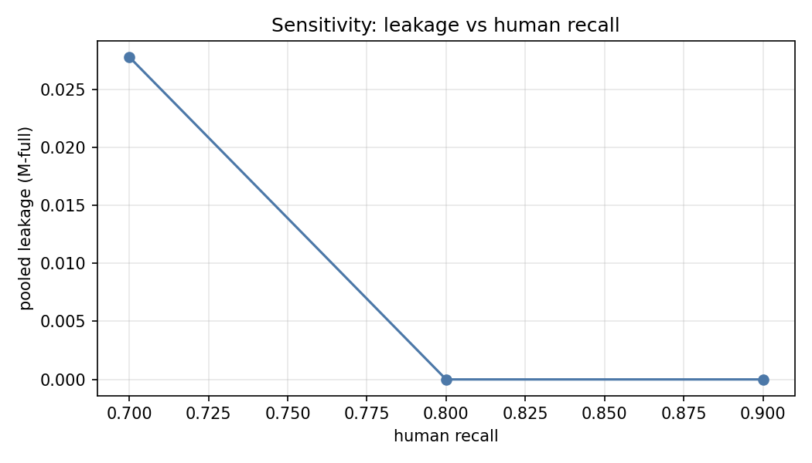
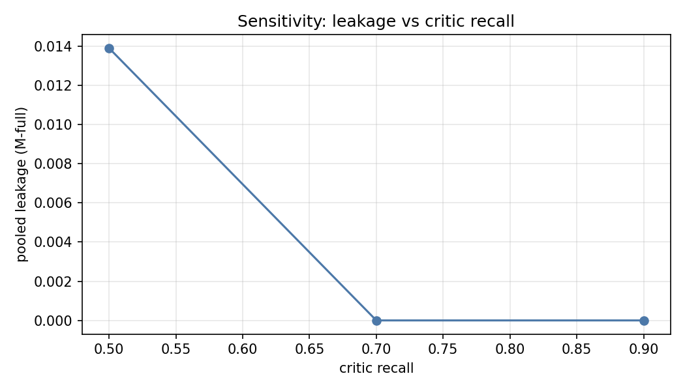
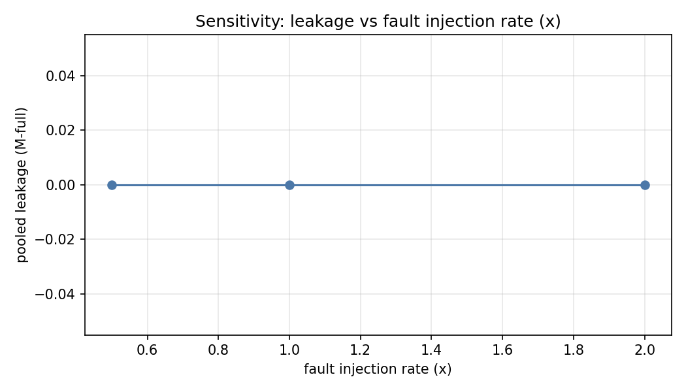
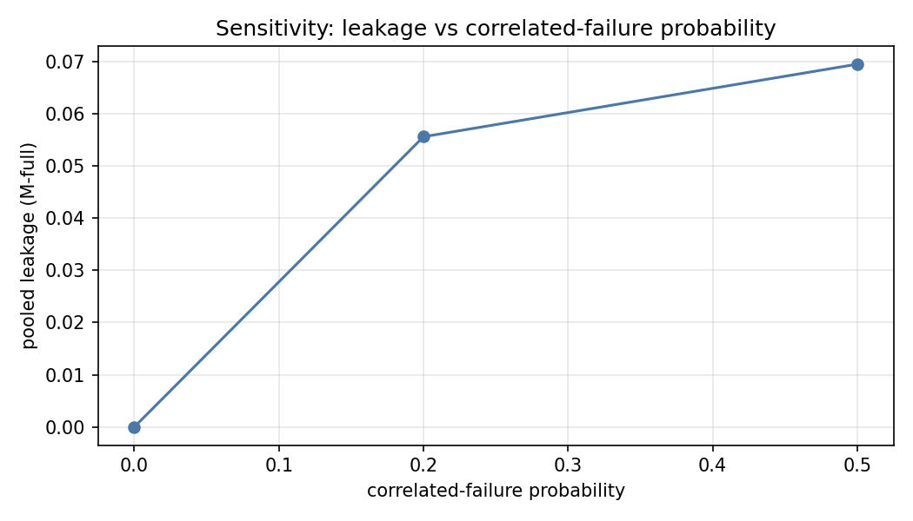

# Sensitivity sweeps (M-full, AEB fixture)

One-way sweeps, 6 seeds per setting. Pooled leakage = total escaped / total injected.

## Sweep table

| Parameter | Value | Pooled leakage | Mean total min | Mean TC |
|-----------|-------|----------------|----------------|---------|
| human recall | 0.7 | 0.0278 | 5035 | 1.000 |
| human recall | 0.8 | 0.0000 | 4991 | 1.000 |
| human recall | 0.9 | 0.0000 | 4991 | 1.000 |
| critic recall | 0.5 | 0.0139 | 4981 | 1.000 |
| critic recall | 0.7 | 0.0000 | 4991 | 1.000 |
| critic recall | 0.9 | 0.0000 | 4998 | 1.000 |
| fault injection rate (x) | 0.5 | 0.0000 | 4894 | 1.000 |
| fault injection rate (x) | 1.0 | 0.0000 | 4991 | 1.000 |
| fault injection rate (x) | 2.0 | 0.0000 | 5041 | 1.000 |
| correlated-failure probability | 0.0 | 0.0000 | 4991 | 1.000 |
| correlated-failure probability | 0.2 | 0.0556 | 4980 | 1.000 |
| correlated-failure probability | 0.5 | 0.0694 | 4981 | 1.000 |

## Sweep figures

## Break-even analysis

At what human-recall level does M-full's total cost exceed B0's? B0's mean total cost is 19719 reviewer-minutes (6 seeds); M-full's cost is swept over human recall:

| Human recall | M-full mean total min | M-full pooled leakage |
|--------------|-----------------------|-------------------------|
| 0.50 | 5035 | 0.0417 |
| 0.60 | 5035 | 0.0278 |
| 0.70 | 5035 | 0.0278 |
| 0.80 | 4991 | 0.0000 |
| 0.85 | 4991 | 0.0000 |
| 0.90 | 4991 | 0.0000 |
| 0.95 | 4991 | 0.0000 |
| 0.99 | 4991 | 0.0000 |

**No crossover in the swept range.** M-full's mean total cost (peak 5035 at recall 0.50) stays well below B0's (19719). M-full's cost is dominated by fixed authoring and review effort; varying human recall only moves the rework component, and higher recall is slightly *cheaper* (early human catches cost less than late test/coverage-driven rework), so the recall level cannot close the gap created by B0's 2.5x manual review effort and full human authoring. In cost terms there is no break-even point: the trade-off is quality (leakage falls with recall) at roughly constant cost.

